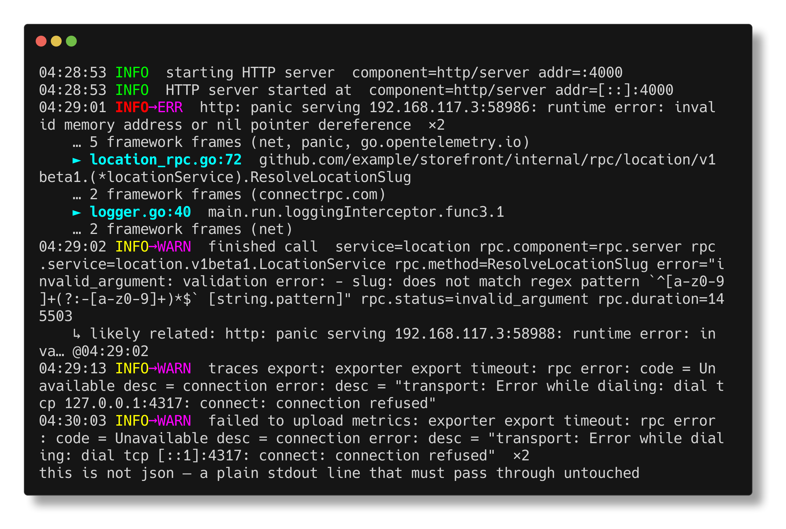
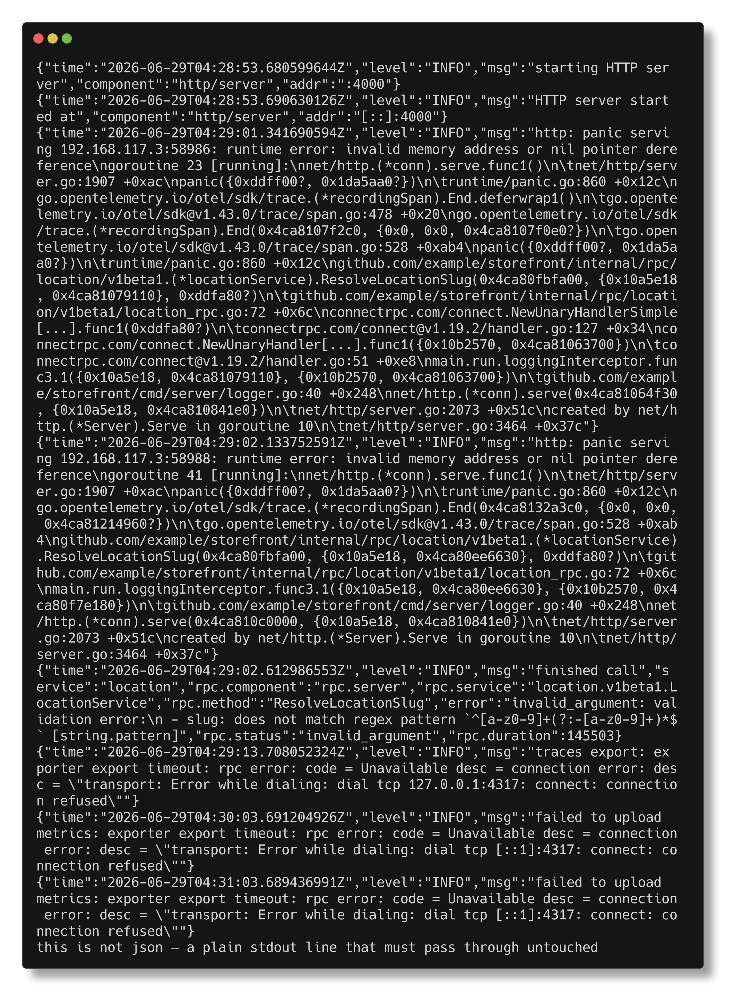

# plog

A zero-config pretty-printer for structured JSON logs. Pipe a noisy log stream
in, get a readable one out:

```sh
docker logs -f storefront | plog
```



This is a spike. It implements the four highest-leverage ideas from
[`IDEA.md`](./IDEA.md); the rest are phase-2.

## What it does

- **Semantic severity re-ranking** — an `INFO` line whose message says
  `panic` / `nil pointer` / `connection refused` is shown as `INFO→ERR` (or
  `→WARN`). Declared severity is never lowered.
- **Stack-trace collapse** — a Go panic serialized into a `msg` field is
  parsed; project frames (your module) are surfaced with `►` and `file:line`,
  while stdlib/third-party frames fold to `… N framework frames (pkgs…)`.
- **Consecutive-duplicate folding** — runs of near-identical lines (variable
  tokens masked: IPs, ports, hex, UUIDs, numbers) collapse to `… ×N`.
- **Adaptive columns** — fields that stay constant across the recent window
  (`service`, `rpc.component`, `rpc.service`) recede, dimmed and prefixed `·`,
  while the fields that distinguish a line (`rpc.method`, `error`,
  `rpc.status`, `rpc.duration`) lead it. Only fields with a single value seen
  repeatedly are demoted — new or varying fields always stay prominent.
- **Request correlation** — records that share a recent correlation key (an
  explicit `trace_id`/`request_id`-style field, or the client IP in the message)
  are tagged `⟨c…⟩` so one request reads as a group. And when a line follows a
  recent, more severe event for the same method within a few seconds, it is
  annotated `↳ likely related: …` — surfacing, e.g., the validation `finished
  call` tied to the panic just before it. The link is a heuristic hint, looks
  only backward (never reorders the stream), and is bounded in memory.
  `--no-correlate` disables it.
- **Robust passthrough** — non-JSON or malformed lines are emitted verbatim; a
  bad line never interrupts the stream.
- **Filtering** — `--min-level` (against the *re-ranked* level), `--grep` (a
  regexp over message and field values), and `--field key=val` (a repeatable
  substring match on any field you name) narrow the stream, combined with AND.
  `--field` makes no assumption about a stream's field names — `--field
  rpc.method=Resolve`, `--field logger=auth`, whatever your logs use. Non-JSON
  lines are never dropped by `--min-level`/`--field`; only `--grep` (on the raw
  line) can hide one.

Color is applied only when stdout is a terminal.

## Before / After

<table>
<tr>
<td align="center"><code>docker logs -f storefront</code></td>
<td align="center"><code>docker logs -f storefront | plog</code></td>
</tr>
<tr>
<td></td>
<td></td>
</tr>
</table>

Same nine records, same information — but now: the panic's severity is
re-ranked `INFO→ERR`, its stack collapses to two project frames (`►
location_rpc.go:72`, `► logger.go:40`) with framework noise folded to `…
5 framework frames (…)`, the duplicate panic on the next connection folds to
`×2`, the validation failure that follows is linked back to the panic with
`↳ likely related: …`, and the repeated `connection refused` metrics error
folds to `×2` as well. The trailing non-JSON line still passes through
untouched.

## Usage

```sh
plog [flags]            # reads stdin, writes stdout

--module string         import-path prefix treated as project code
                        (default "github.com/example")
--no-fold               do not collapse consecutive near-identical lines
--no-columns            do not demote fields constant across the recent window
--no-correlate          do not group records by request or link related events
--min-level string      drop parsed records below this effective severity
                        (debug|info|warn|error)
--grep string           show only lines matching this regular expression
--field key=val         show only records whose named field contains a
                        substring, e.g. --field rpc.method=Resolve (repeatable)
--expand-stack          show every stack frame instead of folding
--no-color              disable ANSI color even on a terminal
```

Try it against the bundled sample:

```sh
go run ./cmd/plog < testdata/sample.log
```

## Architecture

A streaming pipeline, one record at a time, with bounded memory:

```
stdin ──▶ parse ──▶ enrich ─────────────────▶ filter ──▶ correlate ──▶ fold ──▶ render ──▶ stdout
         (line→     (severity + stack          (select   (group +       (collapse  (lipgloss
          Record)    + columns)                 lines)    link)          repeats)   line/block)
```

| Package            | Responsibility                                          |
|--------------------|---------------------------------------------------------|
| `internal/record`  | canonical `Record` type shared by every stage           |
| `internal/parse`   | line → `Record` (ordered JSON walk, passthrough)        |
| `internal/enrich`  | severity re-rank, stack parse, adaptive columns, request correlation, fold |
| `internal/filter`  | pure `Match` predicate (min-level, grep, field)         |
| `internal/render`  | `Renderer` interface + streaming `Plain` (lipgloss)     |
| `cmd/plog`         | flags, TTY detection, pipeline wiring                   |

`Renderer` is a small interface so a future interactive TUI (for the
`plog <file>` case) drops in without changing the pipeline.

### Known trade-off

Folding holds the current run's first record until the run ends, so a live tail
shows folded lines with one line of latency. Use `--no-fold` for zero-latency
raw streaming.

## Develop

```sh
go test ./...                                              # unit tests
go test -run=^$ -fuzz=FuzzParseLine -fuzztime=30s ./internal/parse
```
